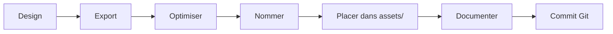

# 📦 ASSETS AFRIQUE BOUSSOLE CREATIVES

**Guide de référence rapide pour tous les assets visuels du Skill**

---

## 🗂️ STRUCTURE

```
assets/
├── 📋 ASSETS-INVENTORY.md        ← Inventaire complet documenté
├── 🎨 brand/
│   ├── logos/                    ← Logos et emblèmes
│   └── icons/                    ← Icônes système
├── 👥 team/                      ← Photos équipe
├── 🎬 visuals/                   ← Rendus 3D et visuels
├── 🚀 projects/                  ← Assets projets clients
├── 📐 templates/                 ← Templates réutilisables
├── 🔗 references/                ← Inspiration et guidelines
└── 🎨 visual-system/             ← Système de design
```

---

## 🚀 QUICK START

### Utiliser un logo
```bash
# Copier dans votre projet
cp assets/brand/logos/afrique-boussole-logo.svg public/

# HTML


# CSS background
background: url('afrique-boussole-logo.svg') no-repeat center;
```

### Ajouter un asset
```bash
# 1. Placer le fichier dans le bon dossier
cp nouveau-visual.jpg assets/visuals/

# 2. Documenter dans l'inventaire
# Éditer ASSETS-INVENTORY.md

# 3. Créer README si nouveau type
echo "# Description" > assets/nouveau-type/README.md
```

---

## 📐 STANDARDS

### Formats recommandés
- **Logos** : SVG (vectoriel)
- **Photos** : JPG 85% qualité
- **Illustrations** : PNG avec transparence
- **Icons** : SVG ou PNG @2x

### Naming
```
{categorie}_{description}_{variant}.{ext}

✅ Bon : team_director_general_2024.jpg
❌ Éviter : IMG_1234.jpg, photo.jpg
```

### Compression
- **Web** : 72 DPI, optimisé
- **Print** : 300 DPI, haute qualité
- **Outils** : TinyPNG, ImageOptim, svgo

---

## 🎯 PAR CAS D'USAGE

### Site web
```
logos/afrique-boussole-logo.svg          → Header
team/*                                    → Page équipe
visuals/gab_3d_compass_africa_*.jpg      → Hero section
```

### Réseaux sociaux
```
logos/afrique-boussole-emblem.svg        → Avatar
visuals/*                                 → Posts
team/*                                    → Profils membres
```

### Print
```
logos/logo.png (@2x)                     → Cartes visite
team/* (300 DPI)                         → Plaquettes
visuals/* (haute res)                    → Affiches
```

### Présentations
```
logos/afrique-boussole-logo-dark.svg     → Slides fond clair
visuals/gab_3d_tech_hub_*.jpg            → Backgrounds
team/*                                    → Diapos équipe
```

---

## 🔍 RECHERCHE RAPIDE

| Besoin | Chemin |
|--------|--------|
| Logo principal | `brand/logos/afrique-boussole-logo.svg` |
| Logo dark mode | `brand/logos/afrique-boussole-logo-dark.svg` |
| Emblème seul | `brand/logos/afrique-boussole-emblem.svg` |
| Photo CEO | `team/team_director_general_*.jpg` |
| Visual 3D Afrique | `visuals/gab_3d_compass_africa_*.jpg` |
| Projet LASTED | `projects/LASTED_*` |

---

## ✅ CHECKLIST AVANT UTILISATION

- [ ] Fichier optimisé (taille raisonnable)
- [ ] Format approprié (SVG/JPG/PNG)
- [ ] Droits d'utilisation vérifiés
- [ ] Respect charte graphique
- [ ] Alt text / description préparée

---

## 📚 DOCUMENTATION DÉTAILLÉE

| Document | Description |
|----------|-------------|
| [ASSETS-INVENTORY.md](./ASSETS-INVENTORY.md) | Inventaire complet avec métadonnées |
| [brand/logos/README.md](./brand/logos/README.md) | Guide utilisation logos |
| [team/README.md](./team/README.md) | Gestion photos équipe |
| [visuals/README.md](./visuals/README.md) | Visuels conceptuels |
| [projects/README.md](./projects/README.md) | Assets projets clients |

---

## 🛠️ OUTILS RECOMMANDÉS

### Édition
- **Vectoriel** : Figma, Illustrator, Inkscape
- **Raster** : Photoshop, GIMP, Affinity Photo
- **3D** : Blender, Cinema 4D

### Optimisation
- **Web** : TinyPNG, ImageOptim, Squoosh
- **SVG** : SVGO, SVGOMG
- **Batch** : ImageMagick, Sharp

### Organisation
- **DAM** : Bynder, Brandfolder, Air
- **Version control** : Git LFS
- **Preview** : Eagle, Bridge

---

## 🔄 WORKFLOW TYPE



---

## 📊 STATISTIQUES

**Total** : 16+ assets organisés  
**Formats** : SVG, JPG, PNG  
**Catégories** : 7 dossiers  
**Documentation** : 6 README.md

---

## 🆘 SUPPORT

**Questions ?** Contactez l'équipe créative :
- 📧 Email : creative@afriqueboussole.com
- 💬 Slack : #team-creative
- 📝 Issues : GitHub repository

---

**Dernière mise à jour** : 24 septembre 2026  
**Maintenu par** : Équipe Afrique Boussole Creatives
